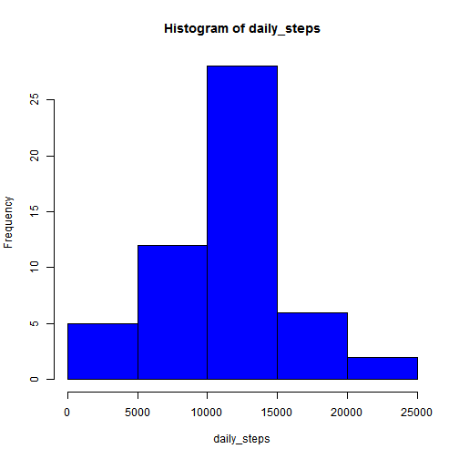
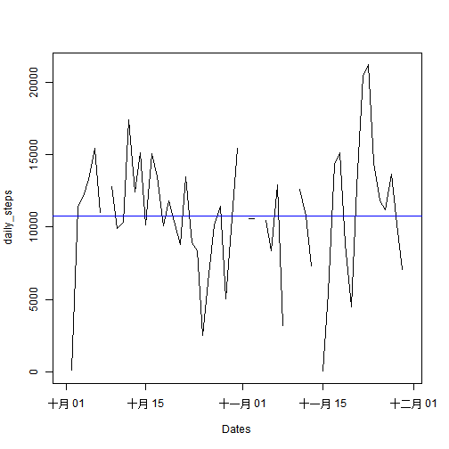
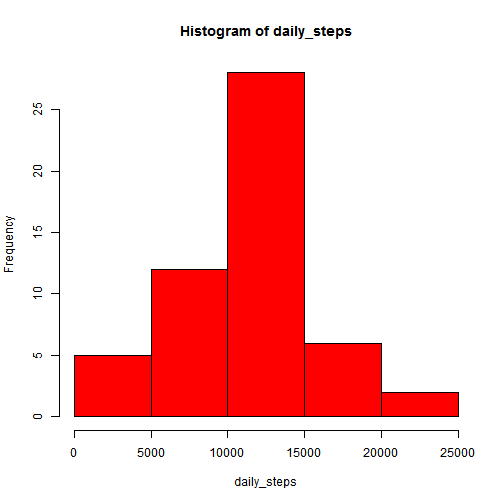
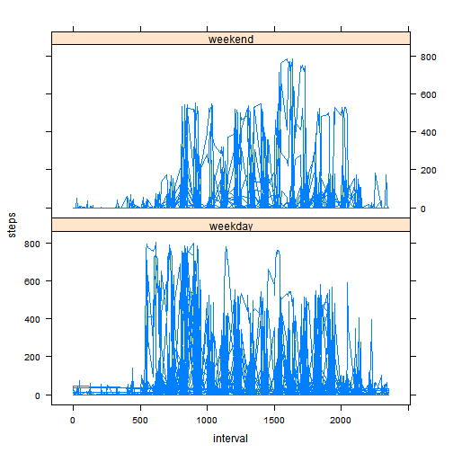

##Loading and preprocessing the data

###1.Load the data 
Make sure that you put activity.csv and PA1_template.Rmd in the same directory.
Read in the data and take a look at it.


```r
act_data<-read.csv("activity.csv")
str(act_data)
```

```
## 'data.frame':	17568 obs. of  3 variables:
##  $ steps   : int  NA NA NA NA NA NA NA NA NA NA ...
##  $ date    : Factor w/ 61 levels "2012-10-01","2012-10-02",..: 1 1 1 1 1 1 1 1 1 1 ...
##  $ interval: int  0 5 10 15 20 25 30 35 40 45 ...
```

##What is mean total number of steps taken per day?

###1.Make a histogram of the total number of steps taken each day


```r
daily_steps<-tapply(act_data$steps, act_data$date, sum, na.rm=FALSE)
hist(daily_steps, col="blue")
```

 

###2.Calculate and report the mean and median total number of steps taken per day


```r
mean_step<-round(mean(daily_steps,na.rm=TRUE))
median_step<-median(daily_steps,na.rm=TRUE)
```
The mean and median total number of steps taken per day are 1.0766 &times; 10<sup>4</sup> and 10765

##What is the average daily activity pattern?

###1.Make a time series plot (i.e. type = "l") of the 5-minute interval (x-axis) and the average number of steps taken, averaged across all days (y-axis)


```r
plot(as.Date(names(daily_steps)),daily_steps, type="l",xlab="Dates")

abline(a=mean(daily_steps, na.rm=TRUE),b=0, col="blue")
```

 

*you may notic that the X axis was labeled in Chinese because of my system language, if you reKnit this Rmarkdown file, you will get the label of your system language.


###2.Which 5-minute interval, on average across all the days in the dataset, contains the maximum number of steps?


```r
max_steps_interval<-tapply(act_data$steps, act_data$date, which.max)

floor(as.numeric(max_steps_interval)/12)*100+as.numeric(max_steps_interval)%%12*5-5
```

```
##  [1]   NA 2210  620 1815 1210 1840 1710   NA  810 1205  825  900  850 1035
## [15]  835  815  830  815 1825 2025 2020 1140 1200 1900 1950  850  915  815
## [29] 2050 1835  730   NA  815  925   NA  925  750  850 1550   NA   NA 1310
## [43]  895 1215   NA  325 1025 1710 1635  720  895  830 1935 1520 1600 1035
## [57]  550  615  610  925   NA
```

```r
#With this poor readbility code, the 5-minute interval, on average across all the days in the dataset, contains the maximum number of steps could be calculated

intervals_max<-round(mean(floor(as.numeric(max_steps_interval)/12)*100,na.rm=TRUE))+round(mean(as.numeric(max_steps_interval)%%12,na.rm=TRUE))*5-5


#since the number system of interval counting is 55 system, mean() is not approprate
print(intervals_max)
```

```
## [1] 1185
```
the average 1185th interval across all the days in the dataset contains the maximum number of steps 


##Imputing missing values

###1.Calculate and report the total number of missing values in the dataset (i.e. the total number of rows with NAs)


```r
sum(is.na(act_data))
```

```
## [1] 2304
```
This is th total number of missing values.


###2.Devise a strategy for filling in all of the missing values in the dataset. The strategy does not need to be sophisticated. 

Since the median is more robust, NAs were be replaced by median of all interval steps which is 0.


###3.Create a new dataset that is equal to the original dataset but with the missing data filled in.


```r
act_data_NAfilled<-act_data
act_data_NAfilled$steps[is.na(act_data_NAfilled$steps)]<-0
head(act_data_NAfilled)
```

```
##   steps       date interval
## 1     0 2012-10-01        0
## 2     0 2012-10-01        5
## 3     0 2012-10-01       10
## 4     0 2012-10-01       15
## 5     0 2012-10-01       20
## 6     0 2012-10-01       25
```


###4.Make a histogram of the total number of steps taken each day and Calculate and report the mean and median total number of steps taken per day. Do these values differ from the estimates from the first part of the assignment? What is the impact of imputing missing data on the estimates of the total daily number of steps?


```r
daily_steps_NAfilled<-tapply(act_data_NAfilled$steps, act_data_NAfilled$date, sum, na.rm=FALSE)
hist(daily_steps, col="red")
```

 

```r
#The mean and median with NA removed
print(mean(daily_steps,na.rm=TRUE))
```

```
## [1] 10766.19
```

```r
print(median(daily_steps,na.rm=TRUE))
```

```
## [1] 10765
```

```r
#The mean and median with NA filled with 0
print(mean(daily_steps_NAfilled,na.rm=TRUE))
```

```
## [1] 9354.23
```

```r
print(median(daily_steps_NAfilled,na.rm=TRUE))
```

```
## [1] 10395
```

Both mean and median droped since NAs were set 0.


##Are there differences in activity patterns between weekdays and weekends?


###1.Create a new factor variable in the dataset with two levels -- "weekday" and "weekend" indicating whether a given date is a weekday or weekend day.


```r
week<-weekdays(as.Date(act_data$date),abbreviate = TRUE)
week[week=="ÖÜÈÕ" | week=="ÖÜÁù"]<-"weekend"
week[week!="weekend"]<-"weekday"
week<-as.factor(week)
```


###2.Make a panel plot containing a time series plot (i.e. type = "l") of the 5-minute interval (x-axis) and the average number of steps taken, averaged across all weekday days or weekend days (y-axis).


```r
library(lattice)
act_data_NAfilled<-cbind(act_data_NAfilled,week)

xyplot(steps~interval | week, data=act_data_NAfilled, layout=c(1,2), type="l")
```

 
